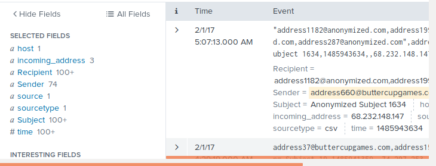
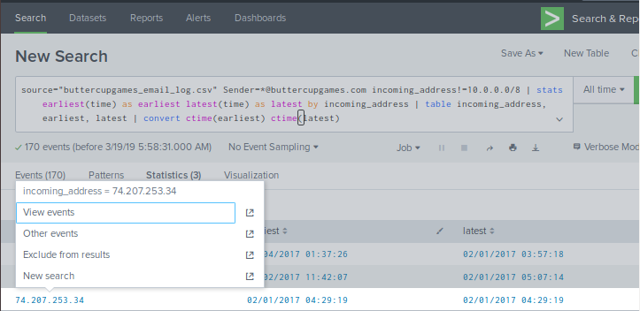
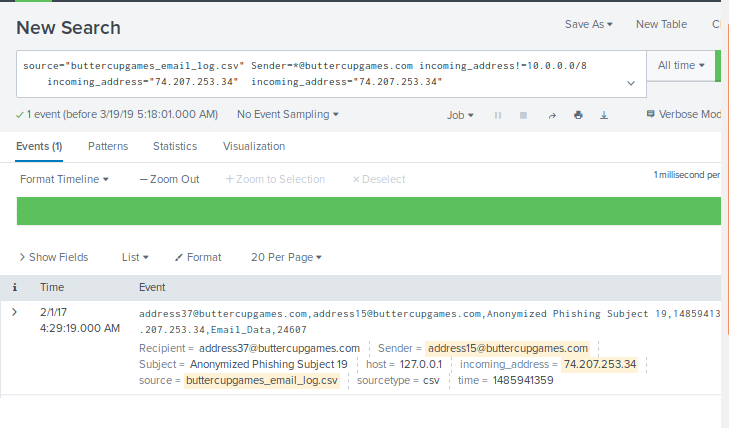
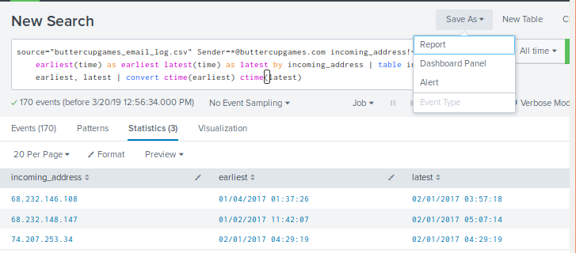
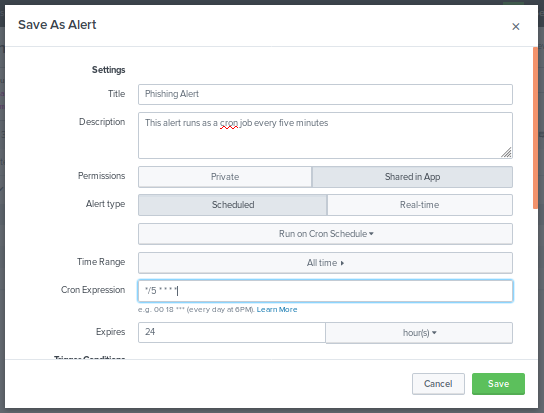
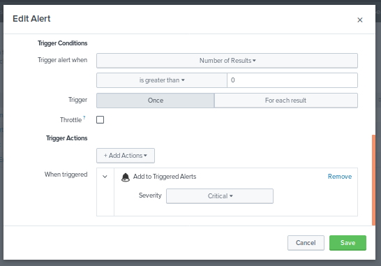
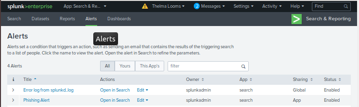
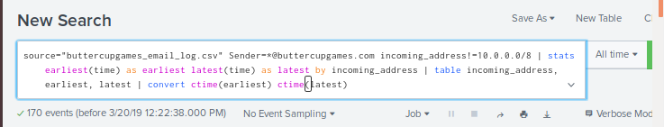
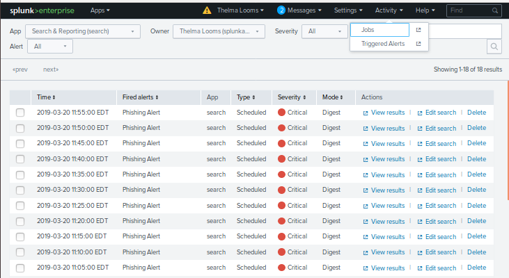
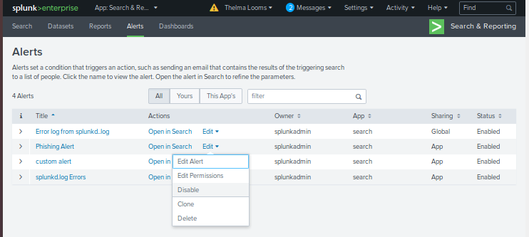

## SIEMs Homework Challenge

## Case Study:  Phishing Attacks (Solution)

This case study uses the `buttercupgame_email_log.csv` file.

1. Locate the fields of interest in **Interesting Fields** and place them in **Selected  Fields**. 


* incoming_address

* Recipient

* Sender

* Subject

* time

    

## Creating the Search 

The search has three parts:

**Part 1:** 

* First, create a search where the Sender is *anyone* from @buttercupgames.com but the incoming IP address is NOT in the domain.

	```bash 
		Sender=*@buttercupgames.com incoming_address!=10.0.0.0/8
	```	
	

**Part 2:** 

* Now locate emails that satisfy the criteria for suspicious emails. Here we will use the **stats** command with the *earliest* and *latest* times *by* incoming IP address. 

	```bash
		stats earliest(time) as earliest latest(time) as latest by incoming_address 
	```

* How is the earliest time displayed? `epoch time`. 

* Check the earliest time for `1483511846` here: https://www.epochconverter.com/
	
**Part 3:** 

*  We are now in the last part of the search.  Place the output of the **stats** command in a **table** showing the `incoming IP address`, and the `earliest date/time` and `latest date/time` in human-readable form.

	```bash
		| table incoming_address, earliest, latest | convert ctime(earliest) ctime(latest)
	```
	
Now look at the results and collect information for the incident report.
	
* What incoming IP address was used in the attack?

	* **79.207.253.34 02/01/2017 04:29.19.000** (earliest) **74.207.253.34 02/01/2017 04:29.19.000** (latest)
	

* Click the suspect **incoming IP address** in the table and select `View Event` until the event is displayed.

    


		


*  Who was the Sender in the Phishing attack?

	* **address15@buttercupgames.com**
	
*  Who was the Recipient of the attack?

	* **address37@buttercupgames.com**
	
*  What was the Subject of the email?

	* **Anonymized Phishing Subject 19**
	
*  What is the time of the event?

	 * **02/01/2017 04:29.19.000**
	
*  Where there any attachments?

	* **NO**
	
## Create a Cron Alert

We can monitor for `phishing attacks` with Splunk by scheduling alerts as a `cron` job.  

Please create a `scheduled cron alert` for the phishing search **which runs every five minutes**.

Review **Linux Day 2** on the `cron command` if you need a refresher on cron syntax. 

* First, run the `phishing` search and select Save As `Alert`.

	

Configure the alert as follows:

* Title: `Phishing Alert`

* Description: `This alert runs as a cron job every five minutes.`

* Permission: `Shared App`

* Alert Type: `Scheduled`, `Run on Cron Schedule`

* Time Range: `All Time`

* Cron Expression:  `*/5 * * * *` **ANSWER**

	

* Trigger Conditions: Keep defaults

* Trigger Actions: 

	* Add Actions `Add to Triggered Alert`

	* Severity = `Critical`

* Save the Alert	

		


### View the Alert

* View the Alert from the **App** bar.

	

### Trigger the Alert

* Run the search - select `All Time`

	

* The alert will be triggered every five minutes.

* Check the `Activity -> Triggered Alert` list.

	

### Disable the Alert 

* Disable the Alert after 10 entries.

	


